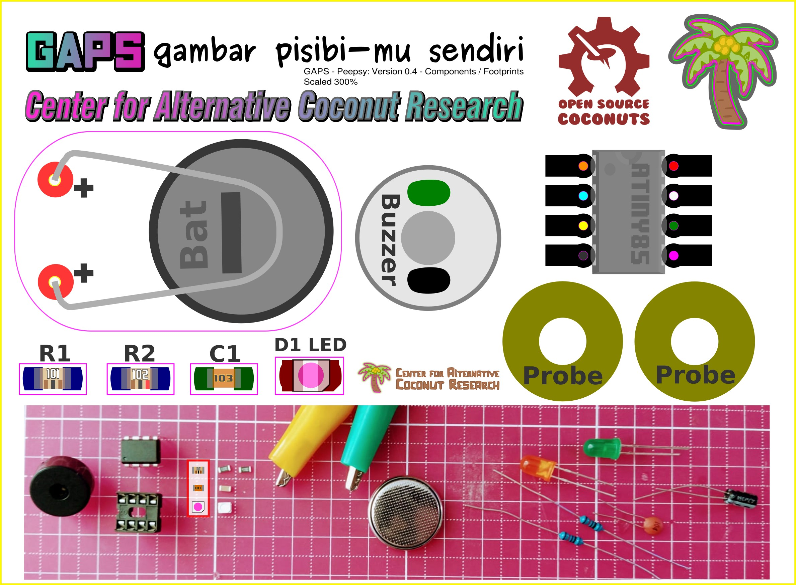

# Peepsy
Simple continuity tester based on Continuity Tester by David Johnson-Davies - www.technoblogy.com

# diy-CAD Handouts
## the schematics

## the BOM also know as the parts

# GAPS Workshops
## GAPS (GaPiSen) | gambar pisibi-mu sendiri - Creative PCB-design Workshop with Diy-CAD, Lifepatch 30. June 2022

## GAPS - Creative PCB-design Workshop, Electronic Wonderland August 2022

