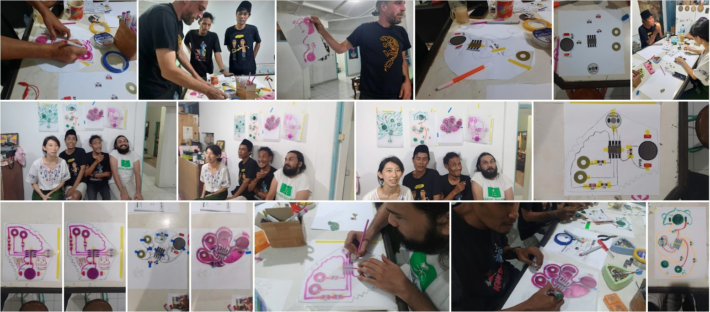

# Peepsy
Simple continuity tester based on Continuity Tester by David Johnson-Davies - www.technoblogy.co

# diy-CAD Handouts
diy-CAD (do-it-yourself Children Aided Design): The core idea of the workshop-kit is tool for creative designs of printed circuit boards, introducing basic concepts of Open Hardware being something to re-design for your own use. 

Read more about the creative PCB design methodology on this wiki: https://www.hackteria.org/wiki/Diy-CAD

## the schematics

## the BOM also know as the parts

# GAPS Workshops
## GAPS (GaPiSen) | gambar pisibi-mu sendiri - Creative PCB-design Workshop with Diy-CAD, Lifepatch 30. June 2022

## GAPS - Creative PCB-design Workshop, Electronic Wonderland August 2022

